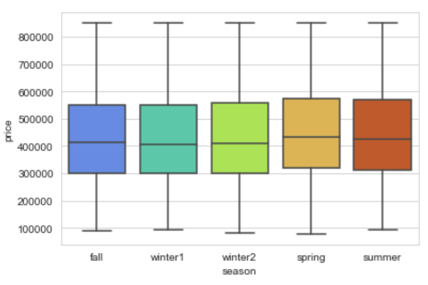

# Project Name
***
Predictions for Housing Prices in King County

# Project Description
***
For this project, I wanted to look through the data for pertinent information for first time home buyers. I explored home sales prices and used linear regression to build a model that could predict home prices for the area. My goal of the model was to build one that would accurately predict housing sale prices and see which features have the biggest impact on price.

# Data Used
***
Data comes from kc_house_data.csv located in the data folder. This can also be found online. The description of the column names can also be found in the data folder, under columns.md. 

# Data Cleaning and EDA
***
Minimal data cleaning was required, however there was a need to manage null values, duplicates, and values that were odd.<br>
The exploratory data analysis(EDA) sought answers to the following questions:
* Which season is best to buy a house if you want the lowest price?
* Does a waterfront or view make that much difference in the price?
* Are there some grades or conditions that might be out of reach for a first time home buyer?
* Is there an area that we can focus on or eliminate?


```python

```

    zsh:1: unknown file attribute: i


_EDA Answered:_
* First time home buyers should make sure they are buying houses between the months of October through March to avoid paying more for the same house the in spring and summer months.

* Buyers may also choose to look at homes south of longitude 47.5 if they are looking to spend less.

* Most houses have average or higher than average grades and conditions. Houses should be "move-in ready" in most cases.

* If the buyer is wanting extra features like properties with a view or on the water, they may have to wait longer or choose from a limited selection. The buyer will also have to pay approximately \\$116,000 to \\$201,000 more for a house with a view or on the water.

# Feature Selection & Engineering 
***
Here, categorical features were one-hot encoded or binned, and continuous variables were checked for normality. Some features were dropped here as they were duplicating other features, had high multicollinearity or were not applicable to our interests. 

Forward stepwise selection and variance inflation factor (VIF) tests were performed to see which features would be best to use in the linear regression model.

# Modeling and Predictions
***
Five different models were made, excluding the baseline model, to see which model could perform best. All models performed similarly, with the exception of the second model which followed both stepwise selection AND VIF for features selection. 

The two best performing models were the third model - which has features selected using stepwise and VIF as guidelines- and the fifth model - which uses the third model but removes some outliers.

Both models can predict the price of a house within \\$94,752 - \\$100,884 with and accuracy of 65.75% - 65.95%.

# Conclusion
***
* There is a strong relationship between sale price and the year a house was built. One might expect a house's value to go down approximately \\$815-960 every year it gets older.

* Increasing the size of your home will increase the value. For every square foot of living space, one could expect an extra \\$110 on the sale price.

* Adding square footage to the lot does increase the value of property- about .32 or .54 cents for every square foot. That may not sound like a lot of money, but we kept lots that were up to 750,000 square feet. That can add up if the property has a lot of land.

# Future Work
Other topics that would be helpful to evaluate include: 
* Commute times
* Surrounding amenities such as schools, parks, restaurants, grocery stores and other places of interest 
* Vicinity to public transportation or walk-ability
* Comparing to newer data
* Estimating other costs like home insurance and taxes
