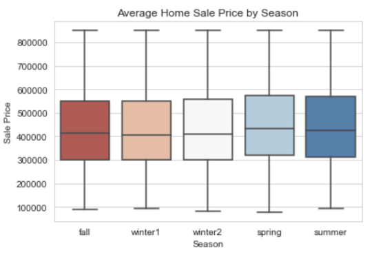

# Project Name
***
Predictions for Housing Prices in King County (Seattle, WA area)

# Project Description
***
For this project, I wanted to look through the data for pertinent information for first time home buyers. I explored home sales prices and used linear regression to build a model that could predict home prices for the area. My goal of the model was to build one that would accurately predict housing sale prices and see which features have the biggest impact on price.

# Data Used
***
Data comes from kc_house_data.csv located in the data folder. This can also be found online. The description of the column names can also be found in the data folder, under columns.md. This data contains 21,596 entries. It spans 2014-2015 and tracks the properties that were sold in King County, Washington. The most populated city in the county is Seattle.

# Data Cleaning and EDA
***
Minimal data cleaning was required, however there was a need to manage null values, duplicates, and values that were odd. 
The exploratory data analysis(EDA) sought answers to the following questions:
* Which season is best to buy a house if you want the lowest price?
* Does a waterfront or view make that much difference in the price?
* Are there some grades or conditions that might be out of reach for a first time home buyer?
* Is there an area that we can focus on or eliminate?

This picture shows the home sale prices within our first time home buyers criteria by the season the house was sold. The seasons are split between spring (April-June), summer (July-September), fall (October-November), winter1 (December) and winter2 (January - March).

Winter1 (December) is the least expensive time of the year. Spring (April-June) is the most expensive time to buy a home in King County. However, from Fall - Winter2 (October- March) the average home sale price has a +/- \\$4,000 range.

_The picture below illustrates the properties that were sold in King County and the color designates which are classified as being a waterfront property or not._

The question to answer was if houses on the water were more expensive, and if so, by how much. Since we have already eliminated houses that are unattainable, a first time home buyer can afford a home on the water, but there are fewer of those properties available.

The chart below shows the average price of homes on or off the water. You will be able to see there is absolutely a price difference between a house on the water and a house more inland.

The following graph shows the relationship between features price, square feet of living space, grade, zip code, and condition - indicated by the color.

 Here, we can see there are an overwhelming number of homes that were sold with a condition of "3". We can also see which zip codes sold the most houses. 
We can also see that even though houses were given higher grades (8+) based on King County's grading system, were given mostly a condition rating of "3" making both grade and condition seem very subjective. 
Also worth noting is the only home with a grade of "3" was given a condition of "5".

Lastly in the EDA, it was interesting to see if there were parts of the county that were more affordable than others and if they could be broken down into quadrants. The image below shows the houses plotted based on their sale price and mapped by their latitude and longitude. The dotted lines were placed based to visualize the different areas.

 The graph below reveals, on average, homes in the southern region of the county are priced lower than those in the north. 

_EDA Answered:_
* First time home buyers should make sure they are buying houses between the months of October through March to avoid paying more for the same house the in spring and summer months.

* Buyers may also choose to look at homes south of longitude 47.5$^{\circ}$ if they are looking to spend less.

* Most houses have average or higher than average grades and conditions. Houses should be "move-in ready" in most cases.

* If the buyer is wanting extra features like waterfront properties, they may have to wait longer or choose from a limited selection. The buyer will also have to pay approximately \\$143,636 more to be on the water.

* Find properties on your own or use alternative methods. Houses that are viewed by more people end up costing more - from \\$128,000 to \\$201,000, on average.

# Feature Selection & Engineering 
***
Here, categorical features were one-hot encoded or binned, and continuous variables were checked for normality. Some features were dropped here as they were duplicating other features, had high multicollinearity or were not applicable to our interests. 

Forward stepwise selection and variance inflation factor (VIF) tests were performed to see which features would be best to use in the linear regression model.

 Here is an example of feature engineering. Rather than having distinct grades from three to eleven, they were binned together. 

# Modeling and Predictions
***
Six different models were made, excluding the baseline model, to see which model could perform best. All models performed similarly, with the exception of the second model which followed both stepwise selection AND VIF for features selection. 

The best perfoming model was the fourth - which has features selected using stepwise and VIF as guidelines.

This model can explain 80% of variations in price and has a mean error on the test group of \\$76,884.

_The three images below show the OLS Regression Results from statsmodels, a Q-Q plot and a visual of the predicted plots. All of these are from the fourth model._

# Conclusion
***
* The model shows a relationship between sale price and the year a house was built. One might expect a house's value to go down approximately \\$75 every year it gets older.

* The model also shows that increasing the size of your home will increase the value. For every square foot of living space, one could expect an extra \\$123 on the sale price.

* Adding square footage to the lot does increase the value of property- about .44 cents for every square foot. That may not sound like a lot of money, but we kept lots that were up to 750,000 square feet. That can add up if you have a lot of land.

# Future Work
***
Other topics that would be helpful to evaluate include:
* Commute times
* Surrounding amenities such as schools, parks, restaurants, grocery stores, hospitals and other places of interest 
* Vicinity to public transportation or walk-ability
* Comparing to newer data
* Estimating other costs like home insurance and taxes
